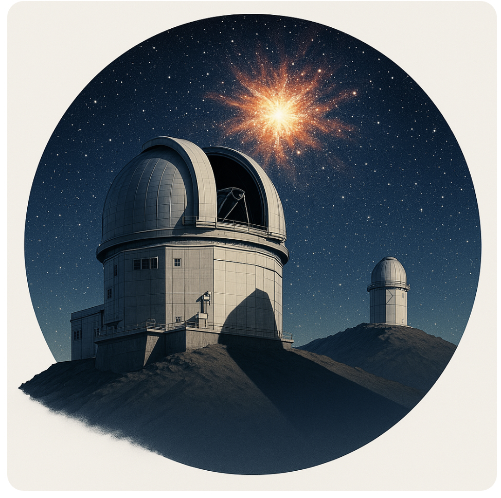

  
  <h1> 👻 {{ site.title }} 🦈 </h1>
  
A collaboration of humans who want to find things that go bump in the night.

  

<section class="about">
  

    Welcome to the {{ site.title }} homepage. We will be doing cool science with DECam as we shadow LSST, focussing on nearby galaxy clusters in order to find young transients!
  

</section>

<h2>Latest Transient</h2>


<a href="{{ latest_transient.url }}">{{ latest_transient.title }}</a>  
<small>{{ latest_transient.date | date: "%B %d, %Y" }}</small>

<h2>Latest Publication</h2>


<a href="{{ latest_pub.url }}">{{ latest_pub.title }}</a>  
<small>{{ latest_pub.date | date: "%B %d, %Y" }}</small>

